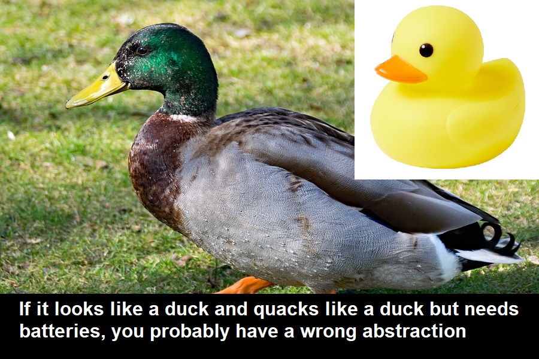
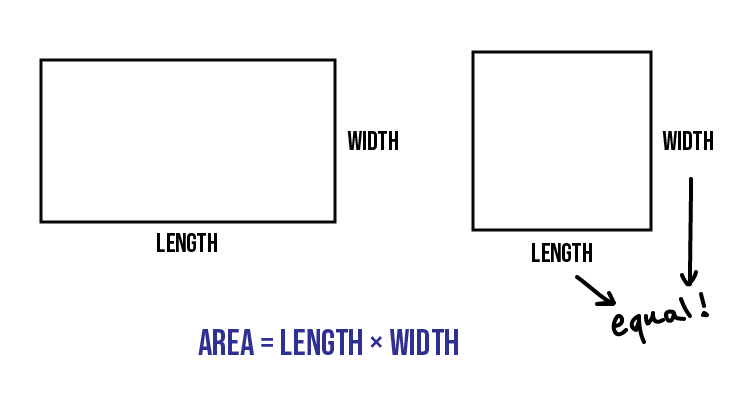
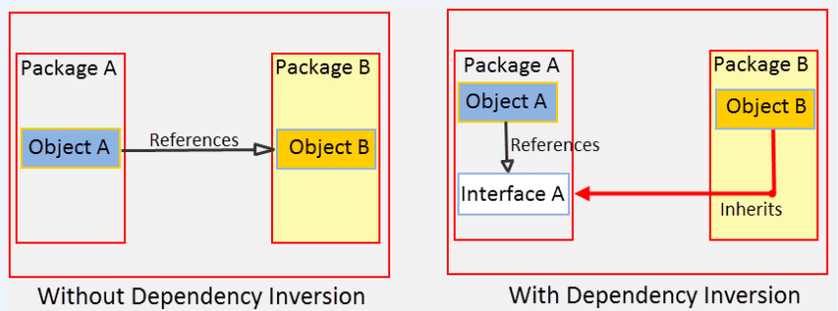

# SOLID 


Clean code is well written code; this is code that is easy to understand, maintain and extend. It has few code smells. It doesn't surprise you and you can tell that the author cared about the code. SOLID principles help you write clean code.

SOLID principles focus on these code smells: 
* **Rigidity**: High rigidity means that code that is hard to change.
* **Fragility**: High fragility means that a small change to one unit can break many other parts of code.
* **Immobility**: This is how easy it it is to extract components.

Clean code is concerned with change. The unique thing about software is that it is never done. There are always new requirements, bug fixes and user stories to work on. But, with a poor quality code, the codebase will become rigid, fragile and immobile. It will be hard and dangerous to change anything.

Besides SOLID principles, clean code is characterized by:

* Unit tests.
* Follows or is inspired by established design patterns.
* Frequent refactoring.

## Single Responsibility Principle


 **SRP: A class should one, and only one, reason to change.**

This is similar to many other ideas, let me go through some of them:

* **Unix Philosophy:** *"Do one thing well. To do a new job, build afresh rather than complicate old programs by adding new features."* 
* **KISS**: Keep classes and functions small and simple. 
* **DRY**: Don't repeat yourself; extract your functions.
* **Curly's Law**: *"A variable should mean one thing, and one thing only. It should not mean one thing in one circumstance, and carry a different value from a different domain some other time."* 

These are similar to SRP but you can’t do SRP without thinking about business and user requirements. SRP is about bundling together things that change together and separating things out that do not. While you want to avoid coupling, you do want your code to have high cohesion. 

This makes common sense. If you want to change how things render, for example, then you should not worry about business rules changing as well.

### Heuristics for Implementing SRP

* **Don’t create big blobs.** A big blob is a very large class; number of lines isn’t that important, what is more important is that it interacts with many other classes. This means that there is high coupling. So for it to operate it needs to know a lot and the application can’t function at all without it.
* **Keep a consistent level of abstraction.** Mixing levels of abstractions together also means that you’re violating SRP. A business rule is of higher abstraction than an implementation of a business rule. An example would be something like converting JSON to an XML document is a low level implementation but then sending out that document to users is a higher level business rule. A class that’s concerned with creating the document should not be also concerned with different types of users and different types of notifications.
* **But, avoid creating middle men.** You should be careful of cutting classes up too thinly. Check out Middle Man code smell. This is when a class just delegates work to another class. So it doesn't do anything of value. Remember that when a class gets too large then you can refactor; there's no need to guess whether a class will become too large.
* **Extract till you drop!** Make your classes and functions as small as possible.

## Open Closed Principle


**OCP: Modules should be open for extension but closed for modification.**

Ideally, You should be able to add new features by adding new code rather than changing old code. This is what open closed principle suggests. Practically, this will not happen all the time but it is an ideal to reach for. This is about minimizing the pain of change, not removing it entirely.

You can't make everything closed for modification but open for extension. And if you could then your codebase will end up having many unused abstractions. There are two ways to find out what to make extensible:

* **By Design**: Consider probable features and problems.
* **Incrementally**: After every code iteration / sprint get feedback and readjust your codebase accordingly

### FizzBuzz

Below is an example of something that does the open for extension part well but this is not open for modification. This thing is a solution to the simple fizzbuzz problem by the way. This is easy to modify, easy to understand and scan. To add a new condition, you probably just need to add a new if statement. But this is not closed for modification. Still as someone who is not a purist in terms of SOLID principles, I like this solution a lot.  

```python 
for i in range(1,101): # 1 to 100
  output = ""
  if i % 3 == 0: output += "Fizz"
  if i % 5 == 0: output += "Buzz"
  if output == "": output = i
  print(output)
```

Someone made a repo which applies OCP to the fizzbuzz problem: https://github.com/jkisor/FizzBuzz

You simply import rules and apply these rules to every number. So you can leave the main class untouched as you add and remove rules that it imports.

It imports class Rule which has an apply method which returns an empty string. Then there are child classes of Rule like MultipleRule which override this method in their own way. The result is the combination of the rules combined.

Let's look at the main class.

The magic happens here:
```java 
for(Rule r : rules) result += r.apply(n);
```
One thing that is not closed for modification is the rule that by default you print out the number. So if not Fizz or Buzz or not something else, you normally have to print out the number. What if I don't want to print the print the number by default? What if I want nothing printed for example? Unfortunately, in the next line you can see that this is embedded into the class: 
```java 
String result = "";
for(Rule r : rules) result += r.apply(n);
if(result.equals("")) result += n; <--- HERE the number is printed out by default if no rule applies
return result;
```

I really like this repo because it is easy to understand because OCP is being used to solve a simple problem. But, in the real world, the above solution is better for a problem that is that simple. It also highlights two problems with OCP: 1 Your code becomes more complicated as you add abstractions and 2 You will have some code that is not open for extension but closed for modification.

### Heuristics for Implementing OCP

* **Implement design patters:** Many design patterns like strategy and decorator help you create code that is open for extension but closed for modification.
* **Add a parameter:** Sometimes simply adding a parameter can solve this issue for you.
* **Avoid hardcode and magic numbers**


## Liskov Substitution Principle


LSP has two definitions: 

* **formal definition:** If S is a declared subtype of T, objects of type S should behave as objects of type T are expected to behave, if they are treated as objects of type T.
* **A less scary definition:** Subtypes must be substitutable for supertypes. The caller should not care that subtype instead of supertype is being used.

### Review of data types
* **Data type:** Is a set of values together with operations
* **Data structure:** Is the physical implementation of a data type

Source: https://cs.lmu.edu/~ray/notes/dtds/

You can combine data types into a data structure but you can also combine data types into a single data type. Generally, a data structure is considered to be a collection of data types. 

You can create a data type called dice which is an array of numbers from 0 to 5 and one method roll which gives you a random number from that array. So, the data type has multiple values, but you either have dice with the whole array or you don’t. 

Another distinction is that a data type can be implemented using data structure. For example, a list can be implemented using an array but also using a linked list.

### Why we care about types
We don’t care about the internals of objects and we shouldn’t care about internals of types. Instead, we care about types in terms of what they do. As a programmer, a number is a number because I can add and subtract. It doesn’t matter to me what code is used to implement that number, just that it works. I suppose knowing the internals of numbers should tell me what are the limits of the numbers but even then I only want limited knowledge of how the numbers are implemented.

So types and objects are about behavior. We should not attempt to replicate the real world but to model the real world and we do this by modelling behavior.

### Heuristics for Implementing LSP

I found these lecture notes to be quite useful: https://ocw.mit.edu/courses/electrical-engineering-and-computer-science/6-170-laboratory-in-software-engineering-fall-2005/lecture-notes/lec14.pdf

In section 3 of these notes, LSP is defined as: 
*"Informally, it states that subtypes must be substitutable for super types. This guarantees that if code depends on (any aspect of) a super type, but an object of a subtype is substituted, system behavior will not be affected."*

This document also has some useful heuristics: 
* **Methods**: For each method in the super type, the subtype must have a corresponding method. Not doing this a code smell called "Refused Bequest." Common solutions: extract a superclass for both to share rather than making one a super type of another, and replace inheritance with delegation.
* **Methods**: Each method should have weaker preconditions and stronger postconditions.
* **Properties**: Any property guaranteed by super type must also be guaranteed by subtype.

#### Example 1: Squares and Rectangles


We can safely and correctly say that a square is a rectangle. But, we may want to treat the two separately.

If you change one side of a square, then the other side will change as well. A rectangle however has length and width; you can change one without changing the other.

But, changing the width of the rectangle should not change its height. So how do you deal with this request? Perhaps add an if statement? Well that would make the application more fragile.

The best solution is to treat the two as different types. A square is a rectangle. But, representatives do not share all features and relationships of the things they represent. Class square is not a square, but code that represents a square.

#### Example 2: List of Types and Subtypes
A subtype is a type but because of LSP a list of subtypes is not a list of types. So a list of cats is not a list of animals when it comes to programming.

Honestly the people at Stack Overflow have done a really good job at explaining this:

https://stackoverflow.com/questions/2745265/is-listdog-a-subclass-of-listanimal-why-are-java-generics-not-implicitly-po


## Interface Segregation Principle

**ISP:  No client should be forced to depend on methods it does not use**

This is essentially SRP for interfaces.

## Dependency Inversion Principle

**DIP: High-level modules should not depend on low-level modules. Both should depend on abstractions (e.g. interfaces). Abstractions should not depend on details. Details (concrete implementations) should depend on abstractions.**



In the above image, Package A uses interface A to execute some function which is implemented by Package B. So Package A uses the interface and Package B implements the interface.

While Package A has runtime dependency on Package B, it does not have compile time dependency. This is because Package B can implement the function however it wants. And we can do this by implementing an interface in between.

In dynamic languages we don't have nor need interfaces. So we don't need to worry about that part. But, we should make sure that details depend on abstractions rather than details.

## More Info

* This website contains various other code smells to consider: https://sourcemaking.com/
* Robert Martin’s blog post on SRP: https://blog.cleancoder.com/uncle-bob/2014/05/08/SingleReponsibilityPrinciple.html
* Data types vs data structures: https://www.integralist.co.uk/posts/data-types-and-data-structures/
