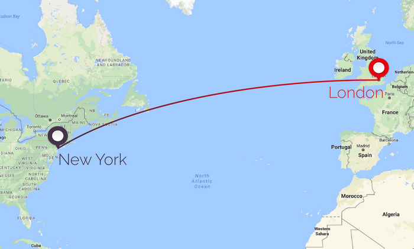

# False Virtue

## False Accuracy

When I was in college, my Physics teacher once told me to avoid “false accuracy” in measurements.

What he means is that I should take measurements at appropriate accuracy. 

People’s heights, for example, can be accurately measured accurately in feet or cm, but not in km or mm. It shouldn’t be measured in mm because peoples' height varies throughout the day. Using mm will give you the false impression that people’s height is more static that it actually. You are also capturing what shoes the person is wearing with mm because if the person changes their shoes then their height in mm will be very different. To be more technical, by measuring in mm, you’re not taking into account the noise and the context of the measurement. Obviously, you also don't want to use km to measure height because most people fall between the 5 feet and 7 feet height range.

Another example, would be the distance between cities. Here feet and cm are not appropriate, but rather km. Imagine I asked you to find the distance from London to New York in mm. First of all, you would rightly see this as a waste of time. But also you would need to know the exact location "London" and the exact location of "New York". Do we mean the centre of each city? If so, where exactly do these cities end? And finally you would need to know the exact time this distance is measured at. Because of, for example, tectonic plates and city growth the correct answer will change. 

## False Consistency

"The flip side of this rule is that asymmetry of function should be reflected by asymmetry of form. Consequently, if you make a habit of prefixing setter methods with “set” (e.g., setText()), then avoid that prefix for methods that aren’t setters.False consistency would suggest making the two methods’ signatures identical, despite the asymmetry of function (namely, sendEventLater() takes ownership of the event, whereas sendEventNow() doesn’t)"

The Little Manual of API Design by Jasmin Blanchette
https://people.mpi-inf.mpg.de/~jblanche/api-design.pdf