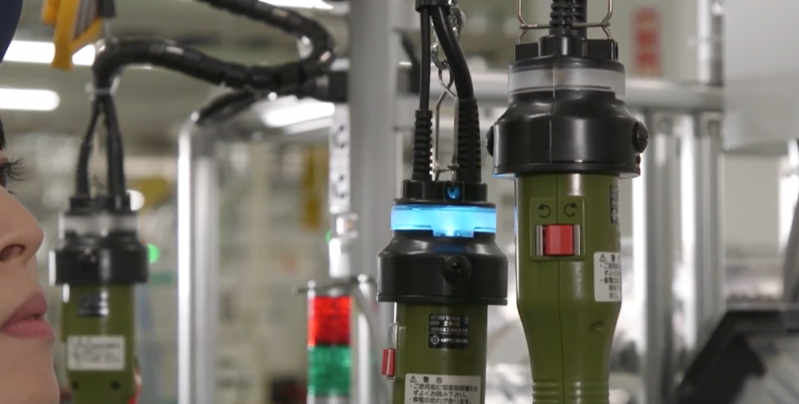

# Poka Yoke

Recently I read about Poka Yoke, a Japanese term for “mistake proofing.” The idea is that part of good UX is not allowing the user make mistakes.

This term in particular comes from Toyota Production System. A common example is that you have to press the clutch before you can start the engine. This helps prevent the car moving backwards accidentally. So the user is prevented from bad UX by this behavior forcing constraint.

Another example is color coding and adding labels to help with identification.

Below is an image of a screwdriver with LED lamp. It is ON which tell the worker to use it rather than a different screwdriver. Thus there’s almost no chance of the wrong screwdriver being used.

In manufacturing, checks are done using counters, detectors, item weight and size checks and normal checklists. Actually, checklists are used a lot in different industries. Pilots for example go through a checklist before take off.

An example of bad design is a time sheet software that I use at work.

If you try to enter time taken or category of your task then immediately you get a warning popup that says “Select Project first.” That is bad design because sometimes I have something in mind and do not want to enter my project title first.

A good solution would be to progressively show what needs to be entered.

A less ideal solution would be throw error only after user tries to submit their info.
