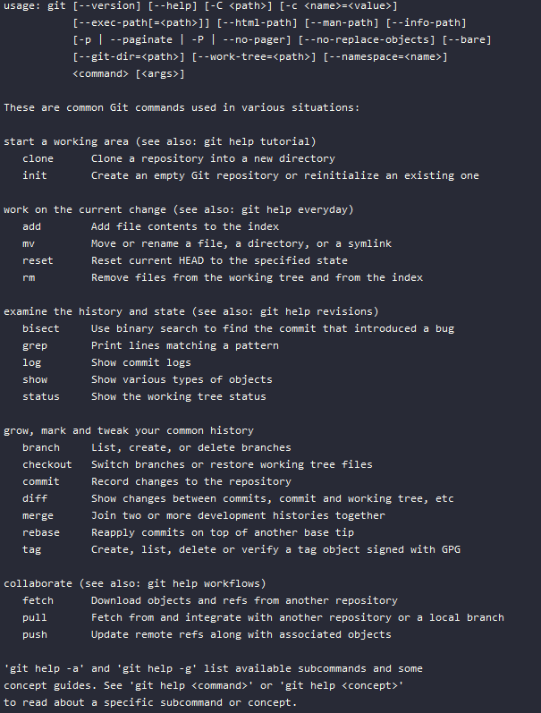

# Git

So, we first install Git, go to the project directory and execute git init.

Then, let’s do Git’s version of “Hello World” with the shell command: `git`

That gives us a decent list of useful Git commands but let me expand on that. 

## Git Commands

| Command | Explanation |
|-------|-------------|
| git reset --hard	| Remove all unstaged changes |
| git branch -a	  | Show all local and remote branches |
| git commit -amend	| Change current commit  |
| git log	  | Show commits. Use --onleline to make it more readable |
| git blame	| Show who made what commits |
| git add -A && git commit -m "commit message"	| Add all tracked files and commit some message |
| git stash	| Save changes for later |
| git show	  | Show current commit details|
| git revert HEAD | Revert last commit. Note: this is tracked. |
| git rebase --interactive HEAD~[N]	          | Squash commits |

## Good Practices

* One Commit / Change: Aim for one commit per one change rather than bundling many changes into one commit. This is especially useful for refactoring. 
* Start with a Summary: Git log will only show the first line. Besides a commit should not include too many changes, so this should be easy to do. Of course, you can add an explanation later.
* Use Full English Sentences: When writing important comments or major commits use full English sentences. Grammar removes ambiguity from plain text i.e. tells you when comment starts and ends and makes parts of the comment clear. Also forces you not to be lazy with commit messages. For small commits, however, small commit messages are more appropriate.
* Commit Often: Smaller commits are better than bigger commits. They are easier for you and others to read and analyze. For newcomers, it’s also good for learning how things work. Also, on your own branch, you can make commits even if it’s work in progress since the pull request will only show the latest branch.
* Keep a Consistent Format: For example, a short summary then the why and then the what.
* State the Obvious: Keep in mind that you will be reading these commit messages in the future for the purpose of debugging or refactoring and when you do, you will forget about the context of the commit. Or, if you’re working on an open-source project, other people will have to read these commits messages to understand the project.

When writing this post, I found out that Git is hosted on GitHub and so I can view their commit history. Here are some notes I made while browsing the repository:
* All git commits have a tag which is the version of Git at that point.
* The commits are not necessarily long. For example, a simple “Doc update” or “A bug documentation.” sufficed for some commits.
* All commits used proper English grammar.
* There were Longer Git commits. They included motivation behind the commit, references to other commits and I also found an ASCII graph in one of the commits.

## Git Internals

Git uses only four different objects: blob, tree, commit and tag.

* Blob: Short for “Binary Large Object” is how your project data is stored in Git. Note that a blob is not the file itself but its contents, so two identical files are one blob; a blob with changed contents is a different blob. Blobs do not reference anything but are referenced by trees.
* Tree: They are used to reference blobs and other trees.
* Commit: Points to a tree. It also contains metadata information such as author and time.
* Tag: Points to a commit.

Other useful concepts:
* Head: Points to the current commit.
* Staging/Index: Contains files that can be committed.

If you want to learn more about Git internals, I recommend: https://wyag.thb.lt/

## Resources

An example of great commit messages I’ve seen is from Andrew Kling for his SerenityOS project. Link to his project: 

https://github.com/SerenityOS/serenity/commits/master 

He also made a video about commit messages:

 https://www.youtube.com/watch?v=Au06IGbtYj0

Another inspiration for my list came from a video by Hvass Labs where he talks about writing code comments:

 https://www.youtube.com/watch?v=akRSHSPw2zA

I like one part in the video where he roughly said something like:

"There is this culture among coders that you are somehow weak if you need comments. But having sparse and incomplete comments does not make you smart and I don’t think anybody has ever in the history of nerdery gotten laid because they do not write comments."

Official Git references: http://git.github.io/git-reference/